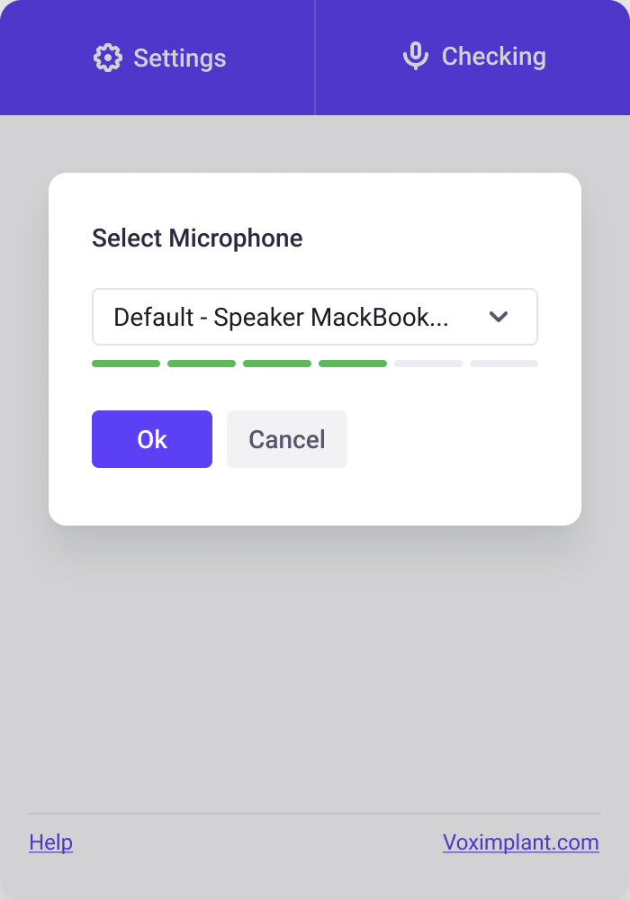

# Zingaya

Zingaya is a web widget that allows users to make one-click calls without leaving the website.

## Features

- Calls from a website to phone numbers / SIP / Voximplant users and queues
- You can dial an extention after the call establishes
- You can mute/unmute your microphone during the call
- You can choose the microphone and test it by recording your voice and playing it back
- You can see the connection status and quality

## Screenshots




## VoxEngine setup

Before you deploy the application, you need to set up the VoxEngine part.

1. Log in to the [Voximplant control panel](https://manage.voximplant.com/)
1. Create [an application](https://voximplant.com/docs/introduction/introduction_to_voximplant/basic_concepts/applications) and [a user](https://voximplant.com/docs/introduction/introduction_to_voximplant/basic_concepts/users)
1. Create two [scenarios](https://voximplant.com/docs/introduction/introduction_to_voximplant/basic_concepts/programmable_voice_and_video/scenarios): one for microphone test, the other one for the call itself
1. Paste this code to the microphone test scenario:
    ```js
    require(Modules.ASR);
    require(Modules.Recorder);
    VoxEngine.addEventListener(AppEvents.CallAlerting, (e) => {
        let recordUrl;
        const recorder = VoxEngine.createRecorder({ hd_audio: true });
        recorder.addEventListener(RecorderEvents.Started, (e) => {
            recordUrl = e.url;
        })
        e.call.say('Hello, welcome to VoxImplant testing service.' +
            'Please record your message,' +
            'afterwards your message will be played back to you.', { "language": VoiceList.Amazon.en_US_Joanna });
        e.call.addEventListener(CallEvents.PlaybackFinished, () => {
            e.call.sendMessage('record');
            e.call.sendMediaTo(recorder);
            e.call.handleMicStatus(true);
            e.call.removeEventListener(CallEvents.PlaybackFinished);
        })
        e.call.addEventListener(CallEvents.MicStatusChange, (e) => {
            if (e.active === false) {
                recorder.stop();
                e.call.sendMessage(recordUrl);
                e.call.removeEventListener(CallEvents.MicStatusChange);
                e.call.startPlayback(recordUrl);
                e.call.addEventListener(CallEvents.PlaybackFinished, () => {
                    e.call.say('If you were able to hear your own voice, ' +
                        'then you have configured your audio recording device correctly.' +
                        'If you hear this message but not your own voice then you need to configure' +
                        ' your audio recording device. Goodbye.', { "language": VoiceList.Amazon.en_US_Joanna });
                    e.call.removeEventListener(CallEvents.PlaybackFinished);
                    e.call.addEventListener(CallEvents.PlaybackFinished, () => {
                        VoxEngine.terminate();
                    })
                })
            }
        })
        e.call.answer();
    })
    ```
1. The call scenario depends on the destination you want to call:
    - If you want to call a Voximplant user, the scenario should be the following:
        ```js
        VoxEngine.forwardCallToUser((call1, call2) => true, true)
        ```
    - If you want to call a phone number, you will need a verified phone number to use as CallerID. You can buy a phone number from Voximplant in the [control panel](https://manage.voximplant.com/). Use the following scenario to call to a phone number.
        ```js
        const callerid = ‘’;
        VoxEngine.forwardCallToPSTN(null, null, {callerid})
        ```
    - If you want to call a SIP user, use the following scenario:
        ```js
        const callerid = ‘’;
        VoxEngine.addEventListener(AppEvents.CallAlerting, (e) => {
            const newCall = VoxEngine.callSIP(e.toURI, callerid, e.displayName);
            VoxEngine.easyProcess(e.call, newCall);
        });
        ```
1. Make the [routing rules](https://voximplant.com/docs/introduction/introduction_to_voximplant/basic_concepts/programmable_voice_and_video/routing) for the two scenarios. The **microphone testing rule** should be on the top and have the following pattern: `testmic`.

## Application setup

1. Download the repository
1. Run `yarn install` or `npm install`
1. Rename the **.env.example** file to **.env**
1. In the **.env** file:
    - Fill your user credentials into the `VUE_APP_USER` and `VUE_APP_PASSWORD` properties
    - Add the number to call to the `VUE_APP_NUMBER` property
    - Fill the `testmic` string to the `VUE_APP_TEST_NUMBER` property
1. Run `yarn serve` or `npm run serve` to run the development build
1. Open the http://localhost:8080/ URL to test the application
1. Once the application works correctly, you can assemble the application
1. If you do not plan to upload the application to the webserver root folder, set up the `publicPath` property in the `vue.config.js` file. [See the instruction](https://cli.vuejs.org/config/#publicpath)
1. To make a production build, run `yarn build` or `npm run build`
1. The `dist` directory will contain the production build ready to upload to the server.

## Folder descriptions

- **public** — Project's static materials, such as favicon and the index.html template, where you can add any additional code, such as action counters
- **src** — Zingaya project code
    - **assets** — Assets: images and sounds
    - **components** — Application source code
    - **router** — Application routing files
    - **views** — Application pages: Home.vue is the default page, Button.vue is the button page to be placed on the website